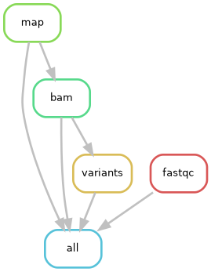

Sylwia Tetela <sylwiatetela6@gmail.com>
22:49 (6 minut temu)
do mnie

# 🧬 SARS-CoV-2 Variant Calling Pipeline (Snakemake)

[](https://snakemake.github.io)
[](https://www.python.org/)
[](https://opensource.org/licenses/MIT)

Zautomatyzowany i powtarzalny pipeline bioinformatyczny w systemie WMS (**Snakemake**) przeznaczony do analizy danych sekwencjonowania wysokoprzepustowego (NGS) dla wirusa **SARS-CoV-2**. 

Pipeline realizuje pełną ścieżkę analityczną: kontrolę jakości odczytów, mapowanie do genomu referencyjnego, przetwarzanie plików BAM oraz detekcję wariantów genetycznych (Variant Calling).

---

## 📐 Graf Zadań Pipeline'u (DAG)

Poniższy graf skierowany (DAG) przedstawia zależności oraz przepływ danych pomiędzy poszczególnymi regułami w pipeline:



---

## 📁 Struktura Katalogów i Plików

```text
sars_project/
├── Snakefile # Główny plik z regułami wykonawczymi Snakemake
├── environment.yaml # Plik konfiguracyjny środowiska Conda
├── README.md # Dokumentacja projektu
├── .gitignore # Wykluczenia dużych plików danych z kontroli wersji
├── dag.png # Graf zależności zadań (DAG)
├── report.html # Zautomatyzowany raport wykonania pipeline'u
├── captions/ # Podpisy i opisy do raportu HTML
│ └── fastqc.rst
├── reference/ # Genom referencyjny (NC_045112.2)
│ └── NC_045112.2.fasta
├── data/ # Dane wejściowe (wykluczone z Git)
│ └── raw/
└── results/ # Wyniki analizy
    ├── SRR19301844_fastqc.html
    ├── aligned_sorted.bam
    ├── aligned_sorted.bam.bai
    └── variants.vcf

